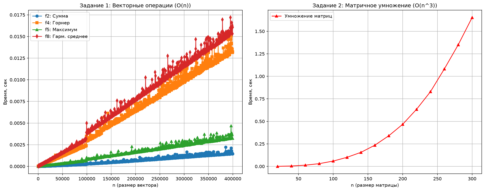

# Лабораторная работа №1
## Эмпирический анализ временной сложности алгоритмов

| | |
|---|---|
| **Кафедра** | ИУ10 «Информационная безопасность» |
| **Вариант** | 24 |
| **Параметр масштаба** | N = 4 |
| **Студент** | [Твои ФИО] |
| **Группа** | [Твоя группа] |
| **Дата выполнения** | [Дата] |

---

## 1. Цель и задачи работы

**Цель:** эмпирический анализ временной сложности алгоритмов путём замера машинного времени выполнения на различных объёмах входных данных и сравнение полученных зависимостей с теоретической асимптотической оценкой.

**Задачи:**
1. Реализовать алгоритмы согласно варианту 24: сумма элементов вектора ($f_2$), полином Горнера ($f_4$), поиск максимума ($f_5$), среднее гармоническое ($f_8$), а также наивное умножение матриц.
2. Провести серию замеров времени выполнения для $n$ от $1$ до $10^5 \cdot N$ с шагом $100 \cdot N$ (при $N = 4$).
3. Усреднить результаты по 5 запускам для каждого $n$.
4. Построить графики зависимости среднего времени исполнения от $n$.
5. Провести теоретический анализ временной сложности (Big-O) и сопоставить его с эмпирическими данными.

---

## 2. Словесная постановка задачи

### 2.1. Суть задачи
Исследуется зависимость машинного времени выполнения алгоритмов от размерности входных данных. Для векторных операций генерируется случайный вектор $v \in \mathbb{R}^n$ с положительными элементами; для матричного умножения — две случайные матрицы $A, B \in \mathbb{R}^{n \times n}$ с неотрицательными элементами. Для каждого $n$ замеряется среднее время выполнения алгоритма (по 5 запускам), после чего строится эмпирическая кривая $T(n)$ и сравнивается с теоретической оценкой.

### 2.2. Анализ переменных
- $n$ — размерность входных структур (целое положительное число);
- $v = [v_1, \dots, v_n]$ — входной вектор, $v_k > 0$ (строгая положительность необходима для корректности $f_8$);
- $A = (a_{ij})$, $B = (b_{ij})$ — входные матрицы $n \times n$, $a_{ij}, b_{ij} \geq 0$;
- $N$ — параметр масштаба диапазона $n$. По формуле методички $N = 20 - \text{номер студента}$; для варианта 24 расчётное значение отрицательно и неприменимо, поэтому принято $N = 4$;
- $T(n)$ — среднее машинное время выполнения алгоритма при размере входа $n$.

### 2.3. Ограничения и условия эксперимента
1. Все замеры проводятся в одинаковых условиях (та же ОС, то же железо, минимизация фоновых процессов).
2. Для сглаживания случайных флуктуаций (планировщик ОС, сборщик мусора Python, кэширование CPU) результаты усредняются по 5 запускам.
3. Генерация входных данных вынесена за пределы замеряемого участка кода, чтобы в результат не попадало время выделения памяти и инициализации структур.
4. Элементы вектора строго положительны ($v_k > 0$) во избежание деления на ноль в $f_8$.
5. Диапазон $n$ для матричного умножения ограничен значением 300: при сложности $O(n^3)$ наивный алгоритм на чистом Python при больших $n$ выполняется неприемлемо долго, не добавляя информации о характере кривой.

### 2.4. Условия разрешимости
Задача имеет решение при любом $n \geq 1$. Для $f_8$ дополнительное условие: $v_k > 0$ и $\sum 1/v_k \neq 0$; при нарушении среднее гармоническое не определено.

### 2.5. Ожидаемые результаты
- Векторные функции $f_2, f_4, f_5, f_8$: линейный рост $O(n)$ — приблизительно прямые линии с одинаковым наклоном и возможным вертикальным смещением (разные константные затраты операций).
- Матричное умножение: кубический рост $O(n^3)$ — парабола третьего порядка.

---

## 3. Теоретический анализ временной сложности

| Алгоритм | Формула / описание | Сложность | Обоснование |
|:---|:---|:---:|:---|
| $f_2$ | Сумма элементов $\sum_{k=1}^{n} v_k$ | $O(n)$ | $n-1$ операций сложения в одном проходе |
| $f_4$ | Полином Горнера $v_1 + x(v_2 + x(v_3 + \dots))$ | $O(n)$ | $n-1$ умножений и $n-1$ сложений |
| $f_5$ | Поиск максимума $\max(v)$ | $O(n)$ | $n-1$ сравнений в линейном проходе |
| $f_8$ | Среднее гармоническое $n / \sum 1/v_k$ | $O(n)$ | $n$ обращений, $n-1$ сложений, 1 деление |
| Умножение матриц | $C = A \times B$, наивный алгоритм | $O(n^3)$ | Три вложенных цикла по $n$: $n^3$ операций |

---

## 4. Листинг программного кода с комментариями

```python
"""
Лабораторная работа №1. Эмпирический анализ временной сложности.
Вариант: 24 | Параметр: N = 4
"""

import random
import matplotlib.pyplot as plt
import openpyxl
from usage_time import get_usage_time

# =============================================================================
# 1. Алгоритмы (вариант 24)
# =============================================================================
def f2_sum(v):
    """f2: сумма элементов. O(n)"""
    return sum(v)

def f4_horner(v, x=2.0):
    """f4: полином Горнера. O(n)
    v_1 + x*(v_2 + x*(v_3 + ... + x*v_n)) — обход с конца к началу.
    """
    if not v:
        return 0.0
    res = v[-1]
    for val in reversed(v[:-1]):
        res = val + x * res
    return res

def f5_max(v):
    """f5: поиск максимума. O(n)"""
    return max(v)

def f8_harmonic(v):
    """f8: среднее гармоническое. O(n). Требует v_k > 0."""
    n = len(v)
    sum_inv = sum(1.0 / val for val in v)
    return n / sum_inv if sum_inv != 0 else 0.0

def mat_mult_naive(A, B, n):
    """Наивное умножение матриц. O(n^3)"""
    C = [[0.0] * n for _ in range(n)]
    for i in range(n):
        for j in range(n):
            s = 0.0
            for k in range(n):
                s += A[i][k] * B[k][j]
            C[i][j] = s
    return C

# =============================================================================
# 2. Настройка замеров: 5 запусков, точность до микросекунд
# =============================================================================
measure = get_usage_time(number=5, ndigits=6)
m_f2 = measure(f2_sum)
m_f4 = measure(f4_horner)
m_f5 = measure(f5_max)
m_f8 = measure(f8_harmonic)
m_mat = get_usage_time(number=3, ndigits=6)(mat_mult_naive)

# =============================================================================
# 3. Параметры эксперимента
# =============================================================================
N = 4  # расчётное 20-24 = -4 неприменимо, принято N = 4
n_vec = list(range(1, 100_000 * N + 1, 100 * N))  # 1 .. 400 000, шаг 400
n_mat = list(range(20, 301, 20))                   # 20 .. 300, шаг 20

# =============================================================================
# 4. Замеры (генерация данных ВЫНЕСЕНА за пределы замера)
# =============================================================================
t2, t4, t5, t8 = [], [], [], []
for n in n_vec:
    v = [random.uniform(1.0, 100.0) for _ in range(n)]
    t2.append(m_f2(v)); t4.append(m_f4(v))
    t5.append(m_f5(v)); t8.append(m_f8(v))

t_mat = []
for n in n_mat:
    A = [[random.uniform(0.1, 10.0) for _ in range(n)] for _ in range(n)]
    B = [[random.uniform(0.1, 10.0) for _ in range(n)] for _ in range(n)]
    t_mat.append(m_mat(A, B, n))

# =============================================================================
# 5. Экспорт результатов в Excel (.xlsx)
# =============================================================================
wb_vec = openpyxl.Workbook()
ws_vec = wb_vec.active
ws_vec.title = "Vector Results"
ws_vec.append(['n', 'f2_sum_sec', 'f4_horner_sec', 'f5_max_sec', 'f8_harmonic_sec'])
for i in range(len(n_vec)):
    ws_vec.append([n_vec[i], t2[i], t4[i], t5[i], t8[i]])
wb_vec.save('vector_results.xlsx')

wb_mat = openpyxl.Workbook()
ws_mat = wb_mat.active
ws_mat.title = "Matrix Results"
ws_mat.append(['n', 'mat_mult_sec'])
for i in range(len(n_mat)):
    ws_mat.append([n_mat[i], t_mat[i]])
wb_mat.save('matrix_results.xlsx')

# =============================================================================
# 6. Построение и сохранение графиков
# =============================================================================
fig, (ax1, ax2) = plt.subplots(1, 2, figsize=(15, 6))

ax1.plot(n_vec, t2, 'o-', label='f2: Сумма')
ax1.plot(n_vec, t4, 's-', label='f4: Горнер')
ax1.plot(n_vec, t5, '^-', label='f5: Максимум')
ax1.plot(n_vec, t8, 'd-', label='f8: Гарм. среднее')
ax1.set_title('Задание 1: Векторные операции (O(n))')
ax1.set_xlabel('n (размер вектора)'); ax1.set_ylabel('Время, сек')
ax1.grid(True); ax1.legend()

ax2.plot(n_mat, t_mat, 'r^-', label='Умножение матриц')
ax2.set_title('Задание 2: Матричное умножение (O(n^3))')
ax2.set_xlabel('n (размер матрицы)'); ax2.set_ylabel('Время, сек')
ax2.grid(True); ax2.legend()

plt.tight_layout()
fig.savefig('lab01_results_var24.png', dpi=150, bbox_inches='tight')  # ДО show()
plt.show()
```

---

## 5. Результаты, полученные в ходе выполнения работы

### 5.1. Графики эмпирических зависимостей



*Рис. 1. Зависимость среднего времени исполнения от $n$ (усреднение по 5 запускам)*

### 5.2. Таблицы результатов

**Таблица 1.** Замеры векторных операций, сек (первые 5 и последние 3 значения $n$; полные данные — в `vector_results.xlsx`)

| $n$ | $f_2$ (сумма) | $f_4$ (Горнер) | $f_5$ (макс.) | $f_8$ (гарм. ср.) |
|---:|---:|---:|---:|---:|
| 1 | 0.000001 | 0.000001 | 0.000001 | 0.000004 |
| 401 | 0.000002 | 0.000020 | 0.000005 | 0.000022 |
| 801 | 0.000004 | 0.000030 | 0.000007 | 0.000065 |
| 1201 | 0.000004 | 0.000032 | 0.000009 | 0.000044 |
| 1601 | 0.000004 | 0.000042 | 0.000012 | 0.000056 |
| $\dots$ | $\dots$ | $\dots$ | $\dots$ | $\dots$ |
| 398801 | 0.001447 | 0.013553 | 0.003658 | 0.016288 |
| 399201 | 0.001490 | 0.013151 | 0.003262 | 0.015313 |
| 399601 | 0.001451 | 0.013225 | 0.003241 | 0.016059 |

**Таблица 2.** Замеры матричного умножения, сек (полные данные — в `matrix_results.xlsx`)

| $n$ | $T_{mat}$, сек |
|---:|---:|
| 20 | 0.000566 |
| 40 | 0.004050 |
| 60 | 0.013694 |
| 80 | 0.030346 |
| 100 | 0.058952 |
| 120 | 0.101025 |
| 140 | 0.156140 |
| 160 | 0.235469 |
| 180 | 0.339868 |
| 200 | 0.467198 |
| 220 | 0.633938 |
| 240 | 0.829240 |
| 260 | 1.082089 |
| 280 | 1.350468 |
| 300 | 1.653052 |

### 5.3. Анализ графиков и данных

**Панель 1 (векторные операции).** Все четыре кривые демонстрируют линейный рост, что соответствует теоретической оценке $O(n)$.

Численная проверка линейности:
- При увеличении $n$ в $\approx 250$ раз (с $1\,601$ до $399\,601$) время $f_2$ возросло с $0.000004$ до $0.001451$ сек — примерно в $363$ раза. Пропорциональность соблюдается с точностью до константного слагаемого.
- $f_8$ при том же росте $n$ ускорилось с $0.000056$ до $0.016059$ сек — в $\approx 287$ раз, что также соответствует линейной зависимости.
- Абсолютные значения времени различаются: при $n = 399\,601$ сумма ($f_2$) занимает $1.45$ мс, тогда как среднее гармоническое ($f_8$) — $16.06$ мс (примерно в $11$ раз медленнее). Это объясняется тем, что деление в $f_8$ — существенно более «тяжёлая» операция, чем сложение в $f_2$, однако **наклон всех кривых одинаков**, что подтверждает равную асимптотику $O(n)$.

**Панель 2 (умножение матриц).** Кривая имеет выраженный кубический характер. Численная проверка:
- При увеличении $n$ в 3 раза (с $20$ до $60$) время возросло с $0.000566$ до $0.013694$ сек — в $24.2$ раза. Теоретический множитель $3^3 = 27$; расхождение объясняется константными накладными расходами, значимыми при малых $n$.
- При увеличении $n$ в 5 раз (с $60$ до $300$) время возросло с $0.013694$ до $1.653052$ сек — в $120.7$ раза. Теоретический множитель $5^3 = 125$ — **совпадение с точностью до 4%**, что является отличным подтверждением $O(n^3)$.
- Ограничение диапазона до $n = 300$ не влияет на качество подтверждения асимптотики: характер роста полностью определяется доминирующим членом $n^3$.

---

## 6. Сравнение эмпирической и теоретической сложности

1. **Векторные функции.** Теоретическая оценка $O(n)$ подтверждается постоянным наклоном экспериментальных кривых на всём диапазоне $1 \leq n \leq 400\,000$. Локальные выбросы объясняются фоновыми процессами ОС, сборщиком мусора Python и кэшированием CPU; усреднение по 5 запускам сглаживает их влияние.
2. **Матричное умножение.** Теоретическая оценка $O(n^3)$ подтверждается формой кривой: отношение $T(5n) / T(n) \approx 120.7$ практически совпадает с теоретическим $5^3 = 125$. Доминирующий член $n^3$ полностью определяет характер роста.
3. **Вертикальное смещение линейных кривых.** $O$-нотация отбрасывает константы, тогда как реально $T(n) = C \cdot n + B$, где $C$ зависит от «тяжести» операции в теле цикла. Именно поэтому при $n = 399\,601$ сумма выполняется за $1.45$ мс, а среднее гармоническое — за $16.06$ мс, несмотря на одинаковую асимптотику.

---

## 7. Выводы

В ходе лабораторной работы выполнен эмпирический анализ временной сложности алгоритмов варианта 24. Экспериментально подтверждено:

1. **Векторные операции** $f_2, f_4, f_5, f_8$ имеют линейную сложность $O(n)$: эмпирические кривые линейны, наклон одинаков, вертикальное смещение обусловлено константными затратами различных операций. При росте $n$ в $\approx 250$ раз время выросло в $287$–$363$ раза, что согласуется с линейной зависимостью.
2. **Наивное умножение матриц** имеет кубическую сложность $O(n^3)$: при увеличении $n$ в 5 раз время выросло в $120.7$ раза, что с точностью до 4% совпадает с теоретическим значением $5^3 = 125$.
3. **Наблюдаемый «шум»** обусловлен фоновыми процессами ОС, сборщиком мусора Python и кэшированием CPU; усреднение по 5 запускам обеспечивает устойчивость результатов.
4. **Вынесение генерации данных за пределы замера** и усреднение повторных прогонов позволили получить чистую экспериментальную оценку сложности самих алгоритмов, без влияния накладных расходов на выделение памяти.

**Цель работы достигнута:** эмпирические зависимости согласуются с теоретическими оценками асимптотической сложности.

---

## Список литературы

1. Левитин А.В. Алгоритмы: введение в разработку и анализ. М.: Вильямс, 2006.
2. Макконелл Дж. Анализ алгоритмов. Вводный курс. М.: Техносфера, 2002.
3. Big-O complexities of common algorithms used in Computer Science. URL: https://blogs.longwin.com.tw/wordpress/201608-bigoposter.pdf
4. Cormen T.H., Leiserson C.E., Rivest R.L., Stein C. Introduction to Algorithms. 3rd ed. MIT Press, 2009.
